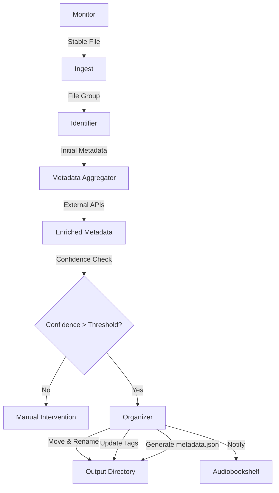

# Architecture

AutoLibrarian is designed as a pipeline that processes audiobooks from ingestion to organization.

## Components

### 1. Monitor (`src/monitor.py`)
The Monitor watches the `INPUT_DIR` for file system events. It uses `watchdog` to detect when files are created or modified. It includes a `StabilityChecker` that ensures files have stopped being written to (size and modification time remain constant for `STABILITY_CHECK_DURATION`) before passing them down the pipeline.

### 2. Ingestion Manager (`src/ingest.py`)
The Ingestion Manager receives stable files from the Monitor. It performs the following tasks:
- **Archive Extraction**: Automatically extracts `.zip` and `.tar` archives into subdirectories.
- **Filtering**: Ignores files with unsupported extensions.
- **Grouping**: Groups related files (e.g., multiple MP3s of the same book) based on their directory. It waits for a short window to ensure all files in a group have arrived.

### 3. Identifier (`src/identifier.py`)
The Identifier attempts to determine the metadata of the book based on the local files.
- **Tags**: Extracts ID3 (MP3) or MP4 atoms (M4B/M4A) metadata like Title, Author, Year, ASIN.
- **Filename**: Parses the filename/directory name using heuristics to extract Title and Author (e.g., "Author - Title").
- **Merge**: Merges the results, prioritizing embedded tags over filename guesses.

### 4. Metadata Aggregator (`src/providers.py`)
The Aggregator takes the initial identification and queries external APIs to enrich the metadata.
- **Providers**: Currently supports OpenLibrary and Google Books.
- **Fuzzy Matching**: Uses `thefuzz` to calculate a confidence score between the local identification and the API results.
- **Enrichment**: Fills in missing details like Description, ISBN, Published Year, and Cover Art URL.

### 5. Organizer (`src/organizer.py`)
The Organizer performs the final actions on the files.
- **Manual Intervention**: If the confidence score is below `MATCH_THRESHOLD_PROBABLE` (default 70), the files are moved to a `Manual_Intervention` folder.
- **Structure**: Moves files to `OUTPUT_DIR` following the structure `{Author}/{Series}/{Title}` or `{Author}/{Title}`.
- **Staging**: Operations are performed in a `.staging` directory first.
- **Tagging**: Updates the file's embedded tags with the enriched metadata.
- **Metadata**: Generates a `metadata.json` compatible with Audiobookshelf.
- **Cover Art**: Downloads cover art if available.
- **Permissions**: Sets file ownership using `PUID` and `PGID`.

### 6. Notification
Finally, the system attempts to notify the Audiobookshelf instance (via `ABS_URL` and `ABS_API_KEY`) to trigger a library scan.

## Diagram

